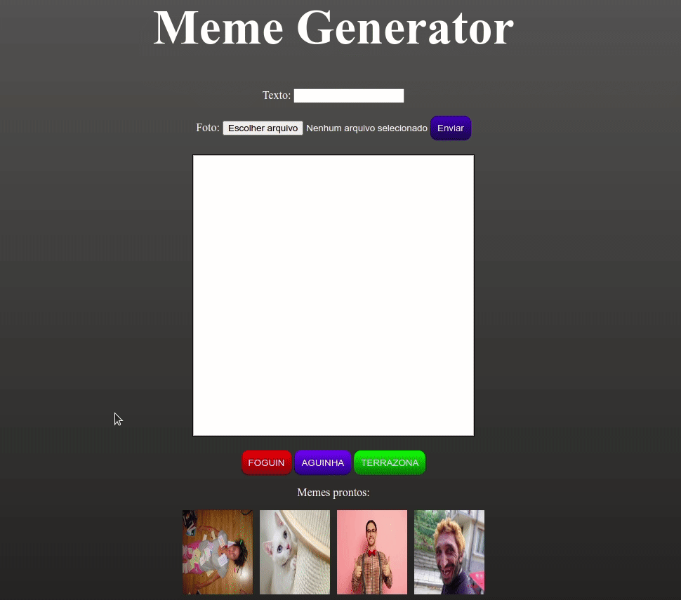

# Meme Generator Project
## A Trybe study project that modifies elements through DOM.

  

  

## :rocket: Technologies
This project was developed with the following technologies:   

- :heavy_check_mark: HTML
- :heavy_check_mark: CSS
- :heavy_check_mark: Javascript 
  

## About this project

The idea about this project is: 
 - Be able to choose a local image to meme generator. 
 - Be able to change borders through buttons: red, green and blue. 
 - Be able to choose default images.
---
 

### Made with :purple_heart: by Patrick =)  

### Connect with me at [LinkedIn!](https://www.linkedin.com/in/patrick-morais/)